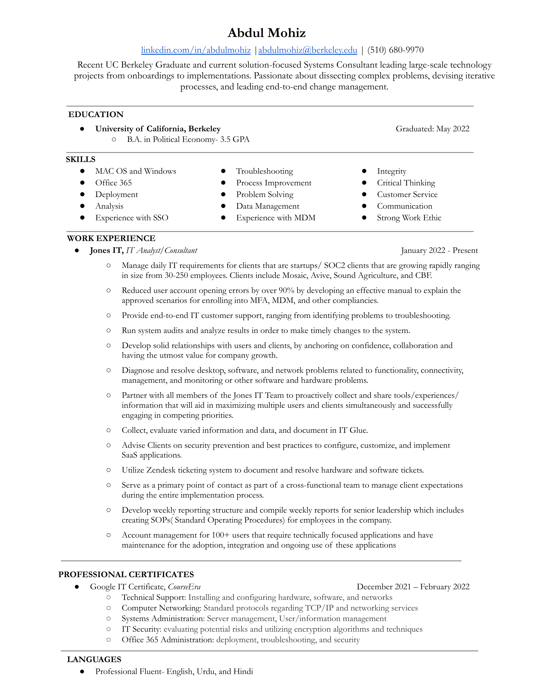

#### This is my personal website. Read on below to learn more about me!
 

  

## An introduction 🤝🏼
My name is **Abdul Mohiz** (spelled عبدالمعز and pronounced Abdul Mohiz). I am the only child and I come from a low income household. I'm also the first in my family to go college. I graduated from UC Berkeley in May 2022, and I currently am on the path to grow in my career! Go Bears!  

## My background 💁🏻‍♂️
🌁 Born in Pakistan and raised in Richmond, CA (East Bay Area)  
🧳 Moved to the states when I was two with my mother while my father was here working.    
🐻 Began my college journey at Cal as an undergrad pursuing Economics 
💻 Shortly after, I took my first Intro to Economics class taught by Professor Olney- I became drawn to it   
🧑‍🏫 Worked various independent roles to support the family while being a full time student.      
🔋 Landed my first full time job at JonesIT(https://www.itjones.com/?utm_term=jones%20it&utm_campaign=SEA%20-%20BRAND&utm_source=adwords&utm_medium=ppc&hsa_acc=1817962299&hsa_cam=933182639&hsa_grp=46006054709&hsa_ad=345498498683&hsa_src=g&hsa_tgt=kwd-886084170675&hsa_kw=jones%20it&hsa_mt=e&hsa_net=adwords&hsa_ver=3&gclid=Cj0KCQiAqOucBhDrARIsAPCQL1ZpGf0UEzl34ZIuWT5wCMo4C3Gn8Dzi3YJQljM9nh0M2P_DQnJXdrAaAmoAEALw_wcB) the last semester I was at Cal. Currently working there as an IT Consultant. However, in my freetime, I am learning Python and enjoying the language and looking to grow in the corporate world. 
❓ But what's next? I'm currently exploring opportunities that apply agile problem-solving, creativity, and technical skills to resolve difficult and nebulous issues, primarily in the fields of data analyst, product management, and entry level programming      

## Hobbies of mine 🙈
🏀 Playing basketball ⛹️‍♂️       
🎽 Doing basically any sort of outdoor/sporty/competitive activity ➡️ 🏂 🏊‍♂️ 🏓 🚴 🏋️ 🚣‍ ⛳ 🎱            
🍳 Eating all types of food 👨‍🍳     
🎧 Listening to music, podcasts, and curating 🔀 playlists      
📚 Reading books 🔖 (mainly genres like science & technology, business and finance, religion, and history)          
🗺️ Traveling, exploring, and simply learning about new cities, countries, and cultures    

## How to reach me 📬
LinkedIn: [(https://www.linkedin.com/in/abdulmohiz/)](https://www.linkedin.com/in/abdulmohiz/))      
Email: [abdulmohiz@berkeley.edu](abdulmohiz.berkeley.edu)  
GitHub: [https://amohiz.github.io/Abdul-Mohiz/](https://amohiz.github.io/Abdul-Mohiz/)

-------------------
<h1 align="center">Resume 👇</h1>

