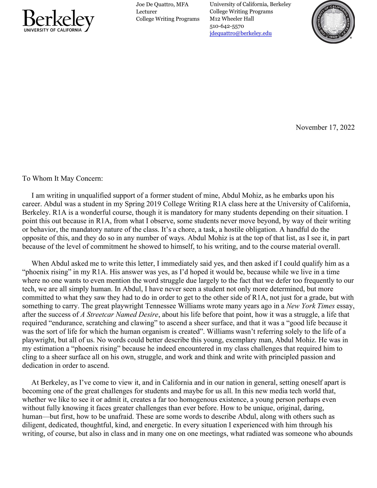
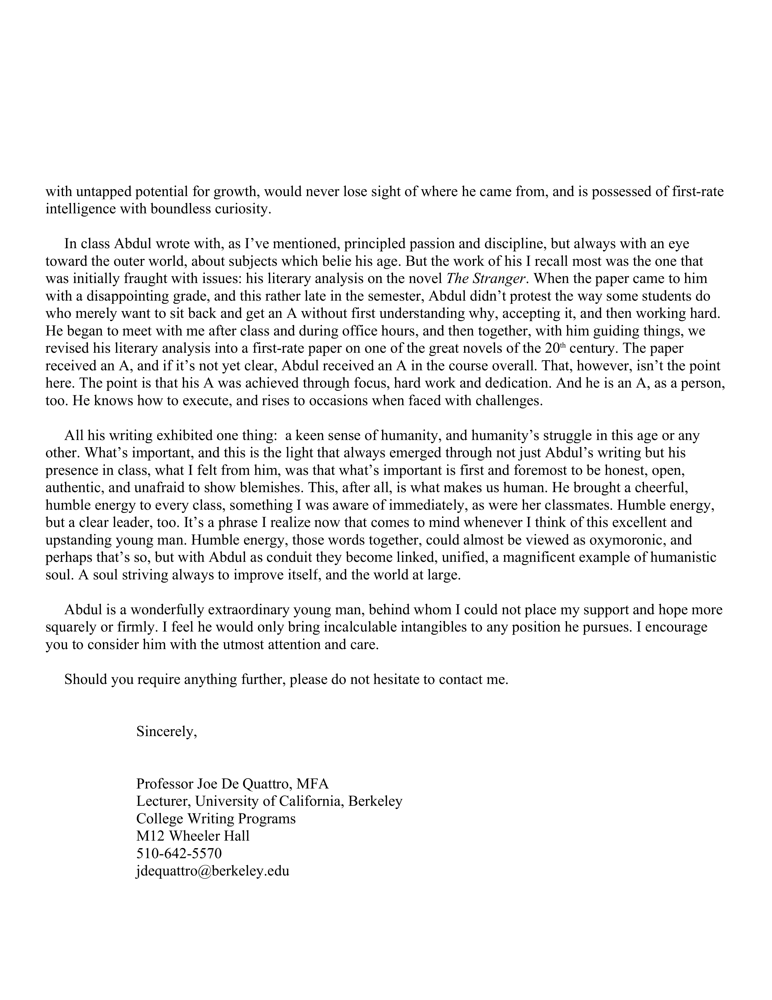

#### This is my personal website. Read on below to learn more about me!
 

  

## An introduction 🤝🏼
My name is **Abdul Mohiz** (spelled عبدالمعز and pronounced Abdul Mohiz). I am the only child and I come from a low income household. Being born in Pakistan and migrating to the United States as a two-year-old with my mother while my father working day and night taught me the importance of hard work. My mother being a homemaker taught me the values of life. Being an only child, I was to fend for myself and it resulted in me becoming the first in my family to attend college, making me a first-generation college student. 

Because of the number of struggles my family went through, I found my motivation; my family. I keen on becoming successful. However, I'm still grateful for these struggles because if it weren’t for these struggles, I may have never co-founded a clothing brand, SalamNation as a junior in high school or be admitted to UC Berkeley right after highschool, and give back to my community with any means possible. I graduated from UC Berkeley in May 2022, and I currently am on the path to grow in my career! Go Bears!  

## My background 💁🏻‍♂️
🌁 Born in Pakistan and raised in Richmond, CA (East Bay Area)  
🧳 Moved to the states when I was two with my mother while my father was here working as a Taxi Cab Driver    
🐻 I started my college career at Cal as an undergrad studying Economics                                                                                    
📝Soon after, I enrolled in Professor Olney's Intro to Economics class; I was drawn to it, and the atmosphere of economics piqued my interest                  
🧑‍🏫 Worked various independent roles with Amazon, DoorDash, Caviar, etc, to support the family while being a full time student      
🔋 My first full-time job was at JonesIT (https://www.itjones.com) during my final semester at Cal. I am currently employed there as an IT Consultant. In my spare time, I enjoy learning Python and hope to attain new skills that will help me advance in the corporate world                                         
❓ But what's next? I'm currently exploring opportunities that apply agile problem-solving, creativity, and technical skills to resolve difficult and nebulous issues, primarily in the fields of data analyst, product management, and entry level programming and wherever my skills take me      

## Hobbies of mine 🙈
🏀 Playing basketball ⛹️‍♂️       
🎽 Doing basically any sort of outdoor/sporty/competitive activity ➡️ 🏂 🏊‍♂️ 🏓 🚴 🏋️ 🚣‍ ⛳ 🎱            
🍳 Eating all types of food 👨‍                                                                                                                               
🤑 Finding different ways to get money                                                                                                                      
🖤 Spending time with Family and Friends                                                                                                                    
📚 Reading books 🔖 (mainly genres like science & technology, business and finance, religion, and history)                                                      
🗺️ Traveling, exploring, and simply learning about new cities, countries, and cultures                                                                      

## How to reach me 📬
LinkedIn: [(https://www.linkedin.com/in/abdulmohiz/)](https://www.linkedin.com/in/abdulmohiz/))      
Email: [abdulmohiz@berkeley.edu](abdulmohiz.berkeley.edu)  
GitHub: [https://amohiz.github.io/Abdul-Mohiz/](https://amohiz.github.io/Abdul-Mohiz/)

-------------------
<h1 align="center">Resume 👇</h1>

-------------------
<h1 align="center">Reference 👇</h1>

